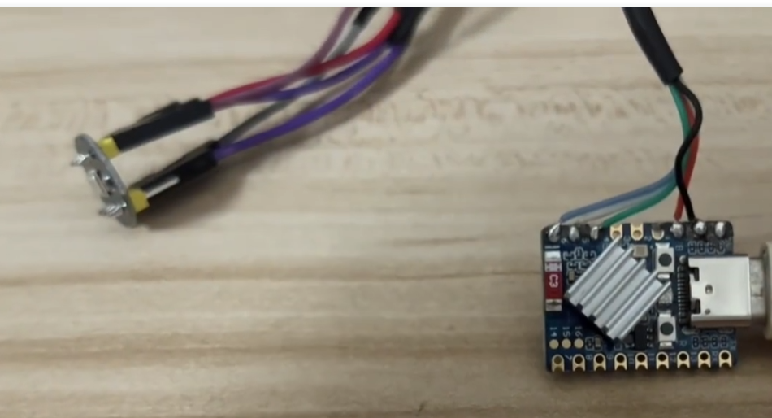

# esp32_inmp441_record

#### 介绍
使用 ESP32 最小板实现录音和播放功能，该方案设计为模块化，能够集成到任何小型设备中。  
通过 MQTT 协议将录音数据发送到服务器，并支持在手机和电脑上进行录音和播放。  
 **B站视频:**  https://www.bilibili.com/video/BV1Hi421Q75x/?vd_source=397d948c14b4366cd3081bc1895a5f79

#### 软件架构
Arduino IDE C语音 MQTT服务器

#### 使用说明

1.  用到硬件: esp32-S3-Zero(主控) inmp441(录音模块) MAX9814音频放大器,喇叭
2.  不会的可以找我: q: 1308137826

 **感谢你对本项目的关注和支持！你的捐赠将帮助我们持续改进和维护这个项目。**   
